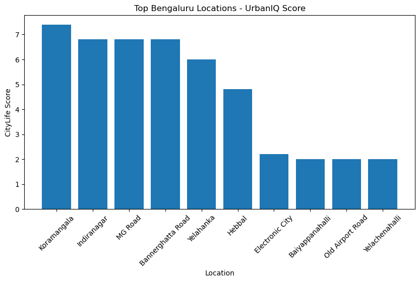

# UrbanIQ 🚀

## Smart City Decision Intelligence Platform

UrbanIQ is a data analytics and AI-powered platform that helps users make better decisions about urban living by analyzing multiple factors that influence quality of life in Bengaluru.

The platform generates a **CityLife Score** for different locations by combining data related to:

* 🏠 Rental affordability
* 🚇 Transportation accessibility
* 🏥 Healthcare availability
* 🏫 Education facilities
* 🌱 Air quality
* 🚦 Traffic conditions

---

# 🎯 Project Goals

* Collect and analyze Bengaluru city datasets
* Clean and transform raw data into meaningful features
* Build a multi-factor **CityLife Score**
* Compare different locations based on lifestyle factors
* Create an interactive dashboard for location analysis

---

# ✨ Features

## ⭐ CityLife Score

UrbanIQ calculates an overall score for Bengaluru locations using:

* Metro accessibility
* Healthcare accessibility
* Education accessibility
* Environment quality
* Traffic conditions

## 🚇 Transportation Analysis

* Evaluates metro availability in different areas
* Generates a Metro Accessibility Score

## 🏥 Healthcare Analysis

* Analyzes hospital availability
* Generates Healthcare Accessibility Score

## 🏫 Education Analysis

* Includes school availability data
* Generates Education Accessibility Score

## 🌱 Environment Analysis

* Uses AQI information
* Creates Environment Score based on air quality

## 🚦 Traffic Analysis

* Considers congestion levels
* Creates Traffic Score

## 📊 Interactive Dashboard

Built using Streamlit:

* Select Bengaluru locations
* View CityLife Score
* Compare individual factors
* View top-ranked areas

---

# 🛠️ Technologies Used

### Programming & Data Analysis

* Python
* Pandas
* NumPy

### Visualization & Dashboard

* Matplotlib
* Streamlit

### Database & Tools

* SQL
* Jupyter Notebook
* Git & GitHub

---

# 📂 Project Structure

```text
UrbanIQ
│
├── data
│   ├── raw
│   │   ├── metro
│   │   ├── hospitals
│   │   ├── schools
│   │   ├── air_quality
│   │   └── traffic
│   │
│   └── citylife_scores.csv
│
├── notebooks
│   └── 03_CityLife_Score.ipynb
│
├── app
│   └── app.py
│
├── images
│   └── citylife_score.png
│
└── README.md
```

---

# 📊 Dashboard Preview



---

# 🚀 How to Run

Clone the repository:

```bash
git clone <your-repository-link>
```

Install required libraries:

```bash
pip install -r requirements.txt
```

Run the Streamlit dashboard:

```bash
streamlit run app/app.py
```

---

# 📈 Project Status

## Completed ✅

* Stage 0: Project Setup
* Stage 1: Data Collection Setup
* Stage 2: Data Cleaning & Feature Engineering
* Stage 3: CityLife Score Development
* Stage 4: Streamlit Dashboard

## Future Improvements 🔮

* Add live AQI API integration
* Add real-time traffic data
* Add Bengaluru map visualization
* Add ML-based location recommendations
* Add user preference-based scoring

---

# 👩‍💻 Author

**Sanjana S**
B.Tech Information Technology
